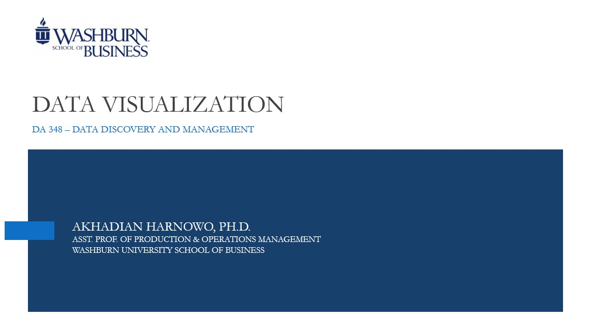

## Welcome to Data Discovery and Management

Data Discovery and Management (DA 348) is the first of four required courses in the Business Data Analytics program at Washburn University. The program provides students with the skill sets needed to transform data into useful information and insights for data-driven decision making. You can read more detailed information about the program from Washburn’s   [Data Analytics](https://www.washburn.edu/academics/college-schools/business/bba-data-analytics.html) page. 

DA 348 can also be taken as an elective course or as a part of a minor. Feel free to contact [me](mailto:akhadian.harnowo@washburn.edu) if you have questions about the course or the program.

### Why taking the DA 348 course?

In DA 348, students will learn Python programming for data analytics. Python programming **opens the door to many opportunities**:
1.Python advances your problem-solving skills and is relatively easy to learn
	
2.Advances business/ data analytics career or get higher salary
+ Python deals with any types of data: numerical, categorical, geographical, text, images, audio, video, etc. (i.e., structured, semi-structured, unstructured data) from various sources
+ Python can perform statistics, predictive analytics, visualization, simulation (prescriptive analytics), among others
+ Python can process large datasets
+ Python can automate many business processes
+ Many (big) companies require python skills
3.Pivots to a different career such as web developer, software engineer, data science, etc.

`Print('Hello World')`

```markdown
Did you know?

Data Analyst Salary (on average) is:

$61,316 according to payscale.com
$62,718 according to glassdoor.com
$63,655 according to salary.com
$67,294 according to ziprecruiter.com

```

_Click_ to learn more about [Washburn School of Business](https://www.washburn.edu/academics/college-schools/business/index.html).


